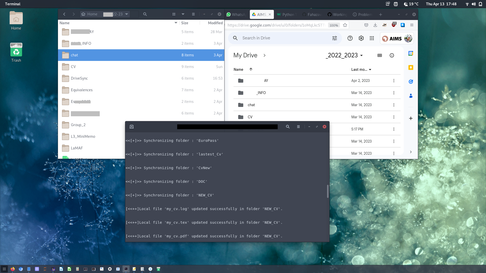

# This script helps synchronize a local folder with your Google Drive folder.

The original repositories are and authors:

* [pedronogs : auto-sync-drive](https://github.com/pedronogs/auto-sync-drive)
* [HowStrange : sync-googledrive](https://github.com/HowStrange/sync-googledrive)

I added some modifications and adapted it for Linux. My next task is to build a graphical interface with Tkinter or make a web app using Flask and add an exclusion files. For Windows users, you can see the links above and adapt the script accordingly.


**Note :** I am note responsible for any loss of your data, use it at your own risk


How to use it :
It is better to create virtual environment if possible :
You can use the following command (In your console) and inside the folder containing this script.

**Before to start you should activate you google API:**
This is the step :
1. Go to https://console.developers.google.com/ and log in with the Google account connected to the Google Drive you want to access.
2. Click on “Credentials” in the left-hand menu.
3. Click on “Create credentials” and select “OAuth client ID.”
4. Choose application type : Desktop app
5. Put a name for example: up_down_Gdrive.
6. Click on Create.
7. On the pop-up click Download json
8. Locate a file starting with "client_secret_..." in your download folder.
9. Rename it to "credentials.json" and put it in the same folder as the python script


**Setting the apps**
1. Create the virtual environment
```
python -m venv venv
```
2. Activate the virtual environment
```
source venv/bin/activate
``` 

**Then the following command will be the same for all (with or without virtual environment)**

3. Install required python packages
```
pip install -r requirement.txt
```

4. Setting 
    * Open your Google Drive folder, the one where you want to synchronize : and copy the last parameter on the link like this (GOOGLE DRIVE FOLDER ID):
    
    * Open the config.json, you will see this :

    ```{json}
    {
    "drive_folder_id": "ID_OF_YOUR_GOOGLE_DRIVE_FOLDER",
    "local_folder_path": "~/PATH/TO/YOUR/LOCAL/FOLDER",
    "log_file_path": false
    }```
Fill the required information, and save it.


5. Running the script:
```
python up_down_GDrive.py
```

On the first run, it will open your web browser to ask for authorization to access your Google Drive through your Gmail account.
If everything is okay, the synchronization will start.
Every time you want to synchronize your folder, just repeat step 5.


A screenshot:



**Enjoy ;)**